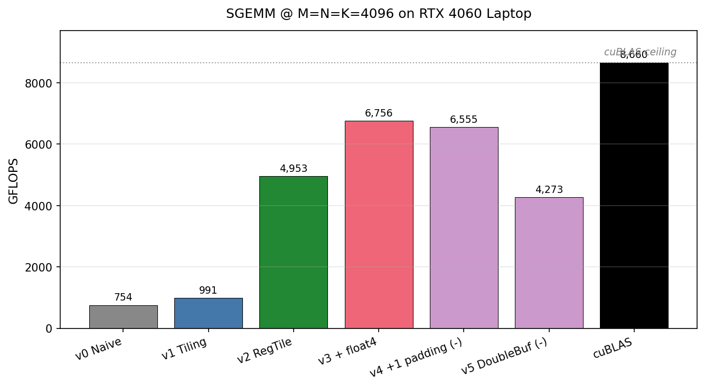
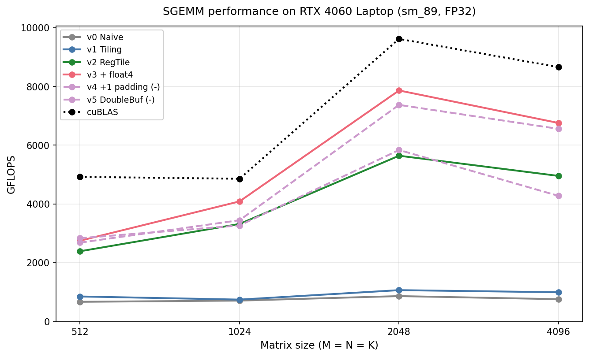

# RTX 4060 上的 CUDA GEMM 优化

[English](README.md) | **中文**

在 NVIDIA Ada Lovelace（sm_89）架构上从零手写单精度矩阵乘法（SGEMM），通过 6 版迭代优化对标 cuBLAS。

项目目标是**教学性的**：每个 kernel 隔离一项优化技术（共享内存 tile / 寄存器 tile / 向量化访存 / bank conflict 消除 / double buffering），让每一步的性能影响都能用 Nsight Compute metric 归因和分析。

本项目刻意包含**两个反面案例**（v4 和 v5）——在老架构上是经典 win 但在 Ada（sm_89）上反而退化的优化。**记录这些反面案例本身就是项目的一部分**。



---

## 性能 Headline

| Kernel | GFLOPS @ M=N=K=4096 | 相对 Naive 加速 | 占 cuBLAS 百分比 |
|---|---:|---:|---:|
| v0 — Naive | 754 | 1.00× | 8.7% |
| v1 — 共享内存 tiling | 990 | 1.31× | 11.4% |
| **v2 — 寄存器 tiling** | 4,953 | **6.57×** | 57.2% |
| **v3 — + float4 向量化访存** ⭐ | **6,756** | **8.96×** | **78.0%** |
| v4 — + 1-padding（反面案例）| 6,555 | 8.69× | 75.7% |
| v5 — Double buffering（反面案例）| 4,273 | 5.66× | 49.3% |
| cuBLAS（Tensor Core, autotuned）| 8,660 | 11.48× | 100% |

> **GFLOPS** = 每秒十亿次浮点运算（Giga Floating-point Operations Per Second）。GEMM 的总 FLOPs = `2 × M × N × K`（每个 FMA 算 2 FLOPs：1 次乘 + 1 次加）。

最优手写 kernel 在纯 FP32 SIMT 下达到 **78% 的 cuBLAS 性能**。剩下到 cuBLAS 的差距来自 Tensor Core / TF32 dispatch 和模板自动调优（autotuning），两者都**有意排除**在本项目范围之外。

---

## 硬件环境

| 组件 | 规格 |
|---|---|
| GPU | NVIDIA RTX 4060 Laptop（Ada Lovelace, sm_89）|
| FP32 峰值 | ~15.1 TFLOPS |
| 显存带宽 | ~272 GB/s（GDDR6）|
| 共享内存 / SM | 100 KB unified L1 + shared（可配置）|
| 寄存器 / SM | 65,536 × 32-bit |
| 工具链 | CUDA 12.4, Nsight Compute 2024.1.1, WSL2 (Ubuntu) |

> 注：本 benchmark 中 cuBLAS 使用 FP32 SGEMM。Ampere 及更新架构上 cuBLAS 可能内部 dispatch 到 TF32 Tensor Core（取决于 `cublasMath` 设置），这是它对纯 FP32 SIMT 手写 kernel 仍然保持难以追平的天花板的原因。

---

## Kernel 版本说明

所有 kernel 共享相同的调用约定：`C = α · A·B + β · C`，行主序存储，支持任意 M / N / K。Block tile、K 维步长、Thread tile 大小都是模板参数；launch wrapper 选具体配置。

| 版本 | 文件 | 优化技术 | 结果 |
|---|---|---|---|
| v0 | `kernels/sgemm_v0_naive.cuh` | 1 thread 1 output；K 循环直接读 global memory。 | baseline |
| v1 | `kernels/sgemm_v1_tiling.cuh` | 共享内存 tile（TILE=32），block 内协作加载，经典 blocked matmul。 | 比 v0 快 30% |
| v2 | `kernels/sgemm_v2_register_tile.cuh` | 每 thread 算 8×8 输出 tile；BM=BN=128, BK=8；**标量** global → shared 加载。64 个寄存器累加器解锁 ILP。 | **比 v1 快 5.0×** |
| v3 | `kernels/sgemm_v3_vectorized.cuh` | v2 + `float4` 向量化 global → shared 加载（128-bit LDG）。load 指令数减半。 | **比 v2 快 1.36×**，最优结果 |
| v4 | `kernels/sgemm_v4_bank_conflict_free.cuh` | v3 + `+1` 共享内存 padding，破坏 shared bank conflict 模式。 | **Ada 上 −3%**（反面案例）|
| v5 | `kernels/sgemm_v5_double_buffer.cuh` | v3 + 双缓冲共享 tile，让 global load 和 compute 并行。 | **Ada 上 −37%**（反面案例）|

### v4 在 Ada 上为什么退化

`+1` padding 把 shared 内存的行 stride 从 16 字节对齐（8 / 128 floats）变成不对齐（9 / 129 floats）。原本的 `float4` 共享内存**写入**操作必须退化成 4 次标量写入，LSU pipe 上的指令数翻 4 倍。在 Ada（sm_89）上，节省下来的 bank-conflict 消耗小于增加的 store 指令开销，**净退化**。

在更老的架构（Volta / Turing）上 shared bank arbitration 开销更大，同样的优化会带来正向收益。**架构相关的优化**——这是这个反面案例最有教学价值的一课。

### v5 在 Ada 上为什么退化

软件 double buffering 让单 block 共享内存翻倍（8 KB → 16 KB），同 SM 能同时驻留的 block 数砍半，**occupancy 减半**。在没有硬件 async copy（`cp.async`，sm_80+）的情况下，nvcc 能调度的"加载/计算重叠"非常有限。Occupancy 损失大于 latency hiding 的收益。

后续路径是 `cp.async` + 多 stage pipeline——本项目刻意推迟到下一阶段。

---

### 不同矩阵尺寸下的 scaling



---

## 编译 & 运行

```bash
make                    # 编译 ./benchmark
./benchmark             # 跑全部尺寸，打印对比表
make clean              # 清理构建产物
```

要求：CUDA toolkit（≥ 11.8），`nvcc` 和 `cublas` 在 linker path 上。Makefile 默认 `sm_89`，其他 GPU 改 `ARCH`。

### 性能分析

每个版本在 N=4096 的 `.ncu-rep` 报告归档在 `nsight_reports/`：

```bash
# CLI section view
ncu --import nsight_reports/v3_vectorized_4096.ncu-rep --section SpeedOfLight
ncu --import nsight_reports/v3_vectorized_4096.ncu-rep --section MemoryWorkloadAnalysis
ncu --import nsight_reports/v3_vectorized_4096.ncu-rep --section WarpStateStats
```

要重新生成报告：

```bash
ncu --set full --kernel-name regex:sgemm_v3_vectorized \
    --launch-skip 39 --launch-count 1 \
    -o nsight_reports/v3_vectorized_4096 -f \
    ./benchmark
```

`--launch-skip 39 --launch-count 1` 跳过小尺寸的 warmup launch，profile M=N=K=4096 的第一发（稳态尺寸）。

GUI 查看：用 Windows / Linux 桌面的 Nsight Compute 直接打开 `.ncu-rep` 文件。

---

## 实验方法论

- **正确性参考**：cuBLAS `cublasSgemm` 是 ground truth。因为 cuBLAS 假设列主序，wrapper 实际计算 `Cᵀ = Bᵀ × Aᵀ`（参数置换调用），等价于把行主序的 `C` 直接得出来——**不需要任何显式转置操作**（同一段内存重新解读 = 自动转置）。
- **计时**：`cudaEvent_t` start/stop 对（GPU-side 计时，没有 host launch overhead）。3 次 untimed warmup + 10 次 timed iteration，取平均值。
- **正确性验证**：每个 kernel 输出和 cuBLAS 元素级对比，`max_abs_diff > 1e-2` 报警（loose tolerance 因为 `--use_fast_math` 启用）。
- **GFLOPS 公式**：`2 · M · N · K / time_seconds / 1e9`——每个 FMA 算 2 FLOPs。

---

## 仓库结构

```
.
├── benchmark.cu                              # benchmark 入口
├── kernels/
│   ├── sgemm_v0_naive.cuh
│   ├── sgemm_v1_tiling.cuh
│   ├── sgemm_v2_register_tile.cuh
│   ├── sgemm_v3_vectorized.cuh
│   ├── sgemm_v4_bank_conflict_free.cuh
│   └── sgemm_v5_double_buffer.cuh
├── include/
│   └── common.cuh                            # CUDA_CHECK / CUBLAS_CHECK / GpuTimer / gflops()
├── nsight_reports/                           # 每版 .ncu-rep 归档
├── Makefile
├── LICENSE
└── README.md / README.zh.md
```

---

## 不在本项目范围

承认存在但本项目不做：

- **Tensor Core / WMMA / `mma.sync`**——cuBLAS 在本设备上更快的主要原因。FP16/TF32 路径是另一个独立项目。
- **`cp.async`**（sm_80+ 异步 global → shared 拷贝）——硬件级 double buffer，按理论可以让 v5 变成正向结果。
- **Warp specialization**（一个 CTA 内拆 producer/consumer）。
- **模板化 autotuning**——遍历 (BM, BN, BK, TM, TN) 空间针对 (M, N, K, sm_xx) 的编译/运行时搜索。

---

## 参考资料

- V. Volkov, *"Better Performance at Lower Occupancy"*, GTC 2010 —— ILP 替代 occupancy 的经典论文。
- NVIDIA CUDA C++ Programming Guide —— 内存模型、bank conflicts、向量化访存。
- NVIDIA Nsight Compute Documentation —— metric 定义参考（`sm__throughput`, `smsp__warp_issue_stalled_*`, `l1tex__t_bytes_*`）。
- CUTLASS（`github.com/NVIDIA/cutlass`）—— 工业级 hierarchical tiling / swizzling / async pipeline 实现参考。
- Lei Mao 的 CUDA 博客（`leimao.github.io`）—— 易读的 step-by-step GEMM 优化教程。

---

## License

MIT —— 见 [LICENSE](LICENSE)。
